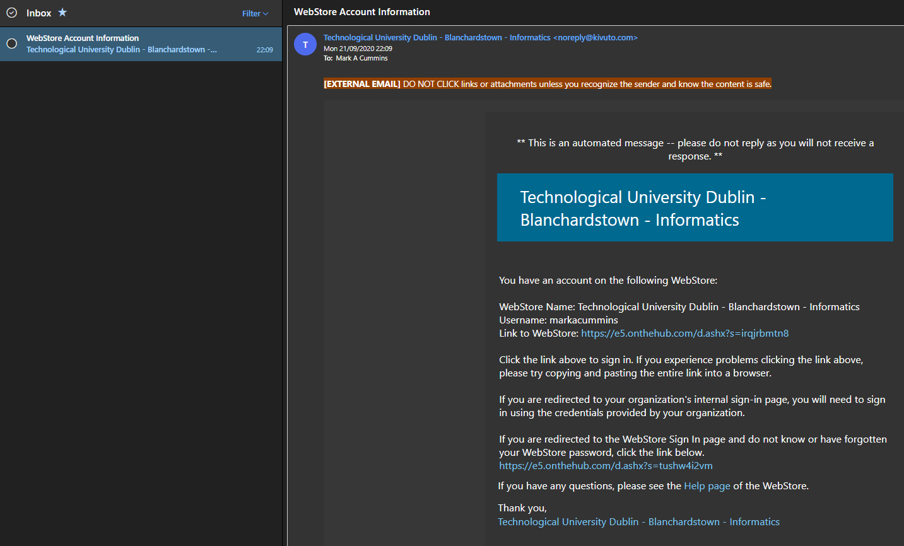

# Getting a VMWare Workstation Pro Licence

I'm recommending VMWare Workstation Pro (Or Fusion on Mac). If you don't manage to get a licence key then the free Virtualbox is a suitable alternative.  

 If you are on my class list then I have already signed you up for a VMware Pro licence. You should have received an email from **WebStore Account Information** with a link to the WebStore where you can get your copy of VMWare Pro for the year. 

> :writing_hand: If you're sure you haven't received a link, then please email me from your university email account, with the subject: VMWare Licence. 

> :warning: You have until **Friday 2nd October** to email me and claim a licence. I wont be adding any more users after that date and you'll have to use Virtualbox. 

Once you've accessed the WebStore, Use the **Forgot username or password?** link near the bottom of the page to allow you reset your password, and login to the WebStore. 

Once you've logged in you should see a link for VMWare Workstation 15.x Pro (or use VMWare Fusion 11.x Pro if on Mac). 

Download the required version of VMWare for your OS and follow the instructions to install your software.
> :eyes: Feel free to look at some of the other available software, some of the packages are free but not all of it.

